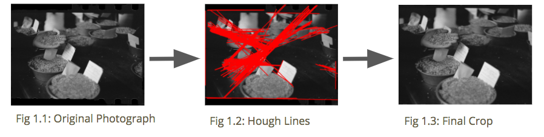
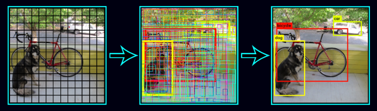
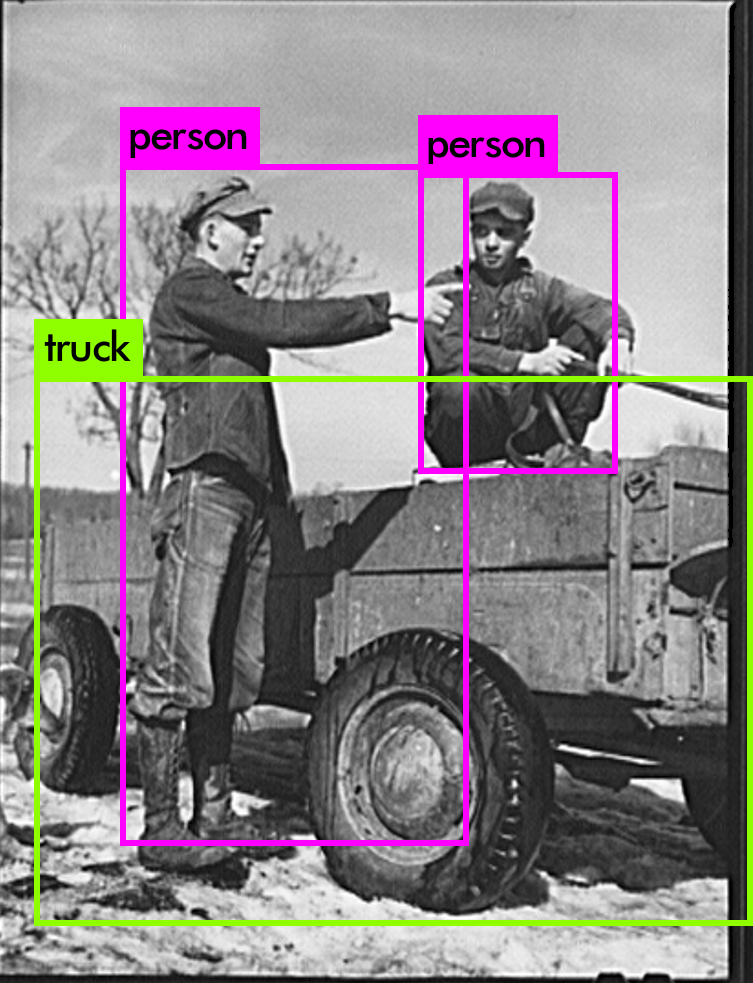

# Depression Era Photos Visualization 

Research Conducted during my internship at SDSC (San Diego Super Computer Center)

## The Problem

Working under Dr. Paul Rodriguez, we were given 171,000 Depression-Era Photos. We were supposed to extract valuable information from these images. The issue was, we had far too many images, and even with access to a supercomputer, it would take forever to test out different methods on the dataset. This meant we needed to test our algorithms first locally, and later, test it on the larger set.

## Features We Looked For

- Object Recognition
- Face Detection

## Initial Hurdles

Looking at the dataset, we quickly realized that each image had a border around them, which we would need to remove.

After looking at the images, I realized that there were straight lines at the top and bottom of the images right before the border. Thus, I employed the usage of the Hough Lines transform in order to find all straight lines. From there, I figured out which were the top/bottom most lines and which were the left/right most lines. Then, I cropped.

## Object Recognition

After first looking for different object recognition softwares, I finally settled on [Darknet](https://pjreddle.com/darknet).

Darknet, more specifically, the YOLO algorithm, allowed us to quickly and easily perform object recognition. By making "predictions with a single network evaluation", Darknet's YOLO is able to perform extremely fast (as it relies on only one NN per image). (Redmon)

We deployed the program on a small sample size of 90 images, and found it having an 82% predictive value.

#### Yolo Results

|       | True           | False  |
| ------------- |:-------------:| :-----:|
| True     | 74 (correctly found the object) | 13 (didn't find the object) |
| False | 3 (incorrectly indentified the object)|  |

## Acknoledgements

Paul Rodriguez (Amazing Mentor)
Ethan Yao (My partner, did the Face Detection)